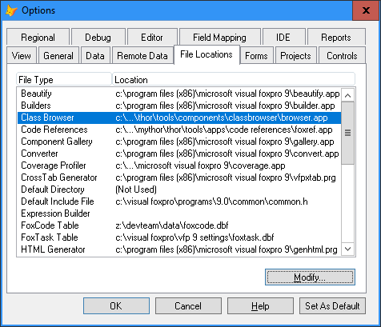

# Class Browser

Version 1.01 Released 2023-01-13

[What's new in this release](Change%20Log.md)

***

The Class Browser displays classes in class libraries or forms and type library information in a type library (.tlb), object library (.olb), or executable (.exe) file. You can use the Class Browser to view, use, and manage classes and their user-defined members.

Class Browser is part of [XSource](https://github.com/VFPX/XSource), the source files for various Visual FoxPro components. The license governing XSource can be found in the XSource_EULA.txt included with all of the XSource releases.

## Installation Instructions (after "Check For Updates" in Thor)

Running "**Check For Updates**" in Thor downloads the new version of the Class Browser but does not activate it, as a few additional manual steps are required.

* Run Thor tool "**Install Class Browser**".  This puts the full path of the new version of the Class Browser file into the clipboard and opens up the VFP Options Dialog. 

* Modify the location for Class Browser by pasting in the new location.
* Click "Set as Default"
* Click "OK"

### Uninstalling (if necessary)

Running the Thor tool "**Install Class Browser**" again will present you with the opportunity to uninstall it (using the same directions as above.)

Note that installing/uninstalling here merely changes the pointer in the VFP Options Dialog.

----
### Video

Ken Levy, the author of the Class Browser, has generously agreed to open source his [video on using the Class Browser](https://vfphelp.com/download/classbrowser_vfp.mp4).

----
## Helping with this project
See [How to contribute to Class Browser](.github/CONTRIBUTING.md) for details on how to help with this project.

Last changed: _2023-01-13_ 
